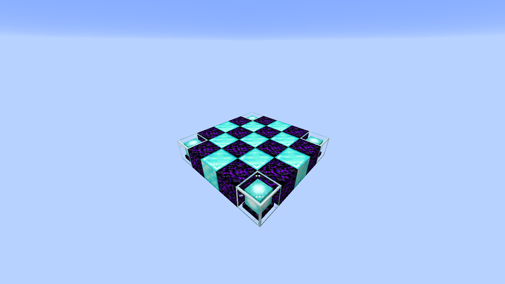
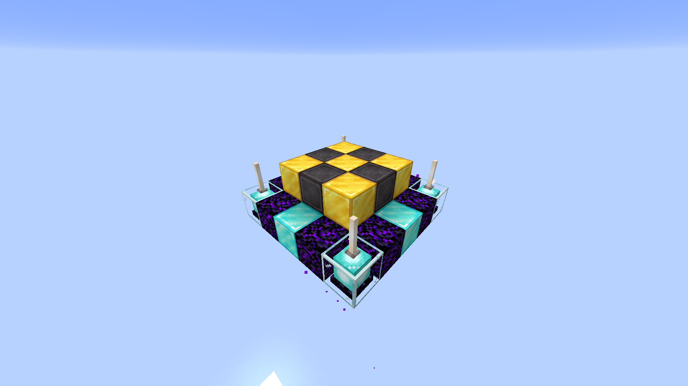
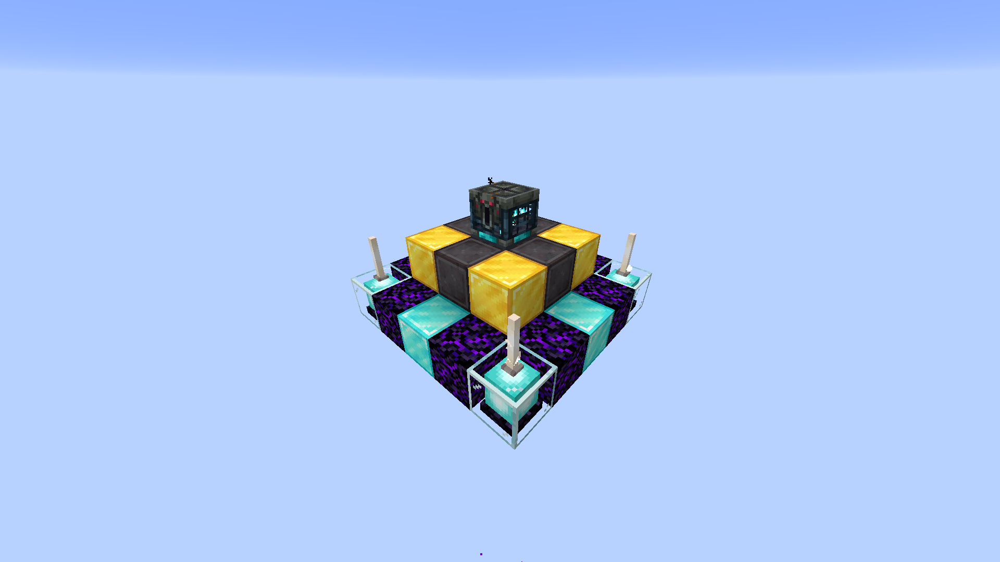
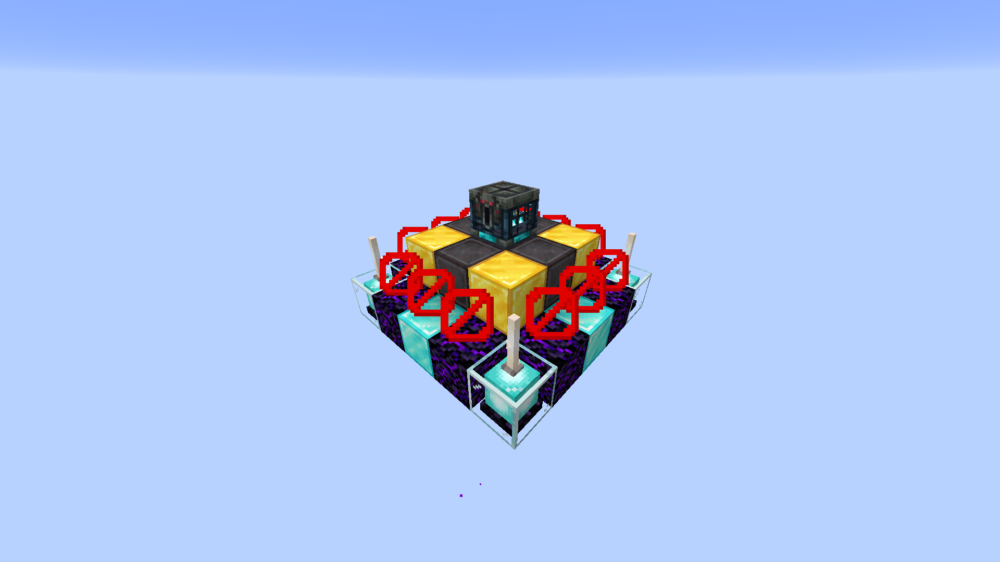
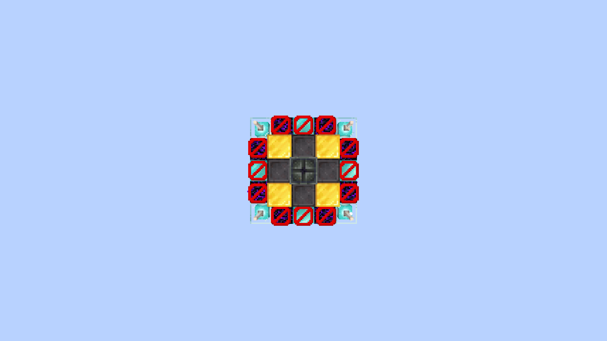
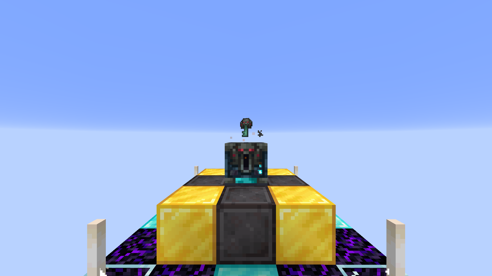
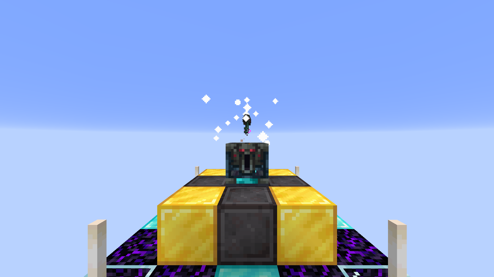
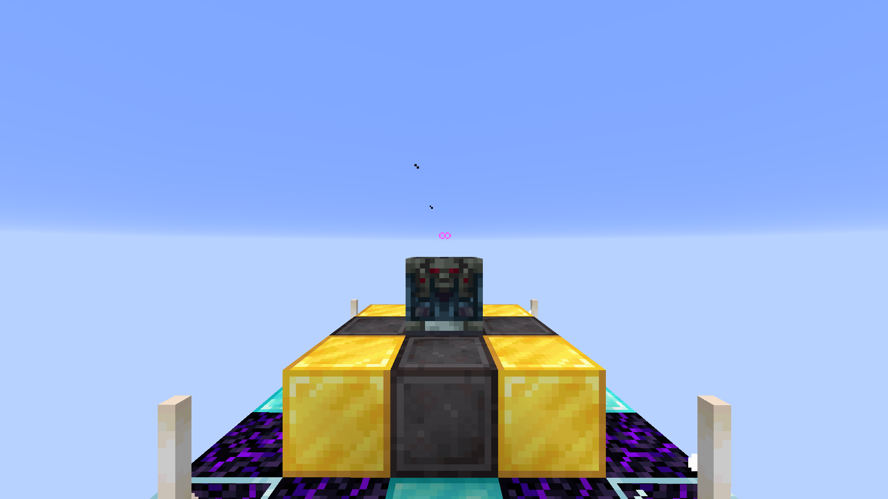
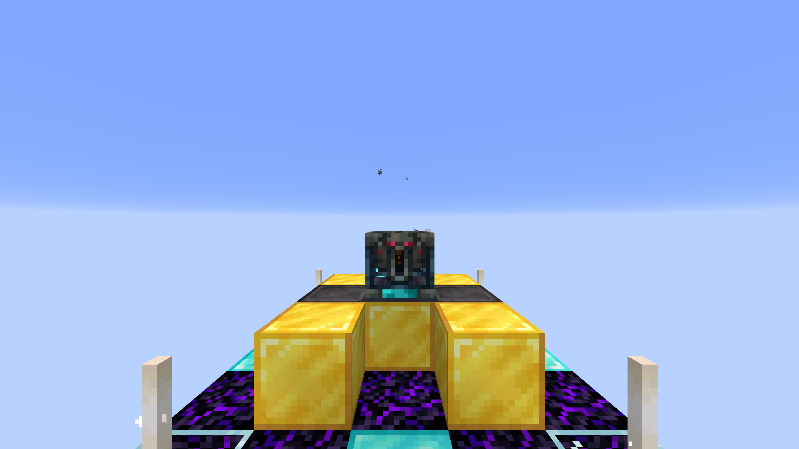

# Vanilla Item+ 用户手册

## 怎么使用？

把 .zip 文件放在`saves/[你的存档名称]/datapacks/` 然后执行`/reload`。

## 如何更改设置？

### 对于1.21至1.21.4的用户

当数据包被加载时会弹出一条信息, 点击 "\[设置\]" 就可以查看详细的设置信息。

你也可以执行 `/reload` 来看到加载信息或者执行 `/function vanilla_item_plus:config_page_main` 来直接看到详细设置信息。

### 对于1.21.6及以上的用户

当数据包被加载时会弹出一条信息, 点击 "\[设置\]" 后你会看到一个对话框。

你也可以执行 `/reload` 来看到加载信息或者执行 `/trigger vanilla_item_plus set 102` 来直接看到详细设置信息。

## 怎样建造无限宝库并激活？

首先跟着下面四步建造结构:

1.用哭泣的黑曜石和钻石块建造一个棋盘样式的平台, 角落上放信标。

 

2.然后再建造一个金块和下界合金块的棋盘样的平台, 并在信标上放上末地烛。

 

3.宝库应该在这个结构中间最顶端。

 

4.确认屏障的位置没有任何东西。

 

当你确认你的结构无误后, 丢一个试炼钥匙(不论是否是不详的)在宝库上。

 

此时宝库应该会被激活。

当你破坏了结构中任意一个方块, 宝库会变回未激活状态。

